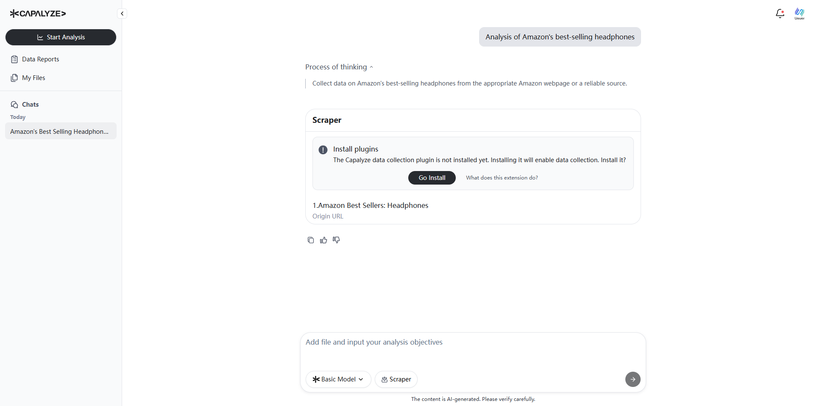
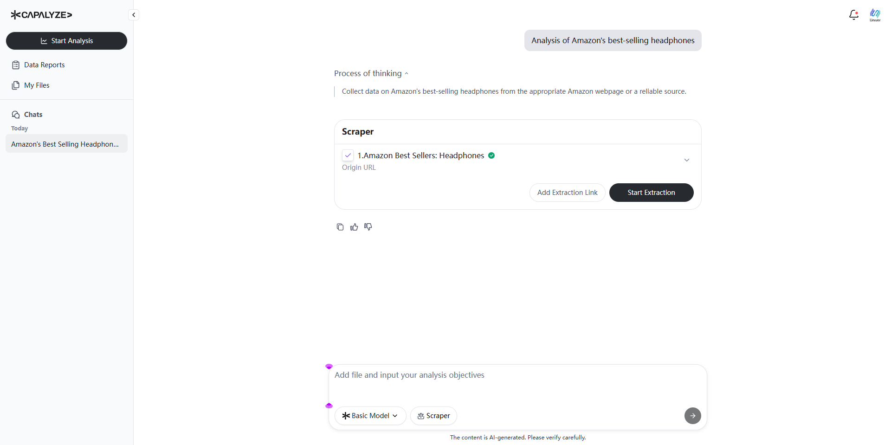
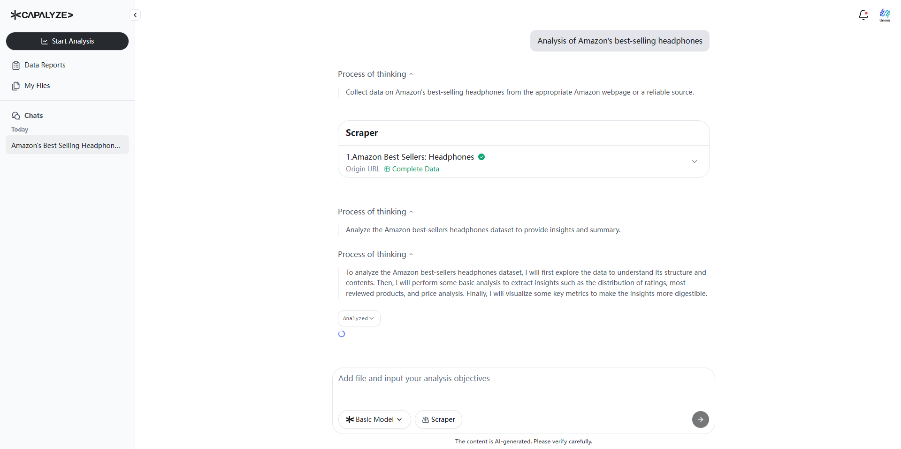
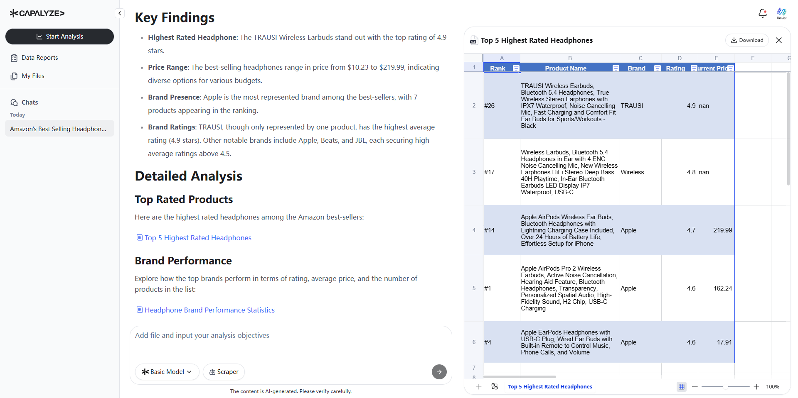
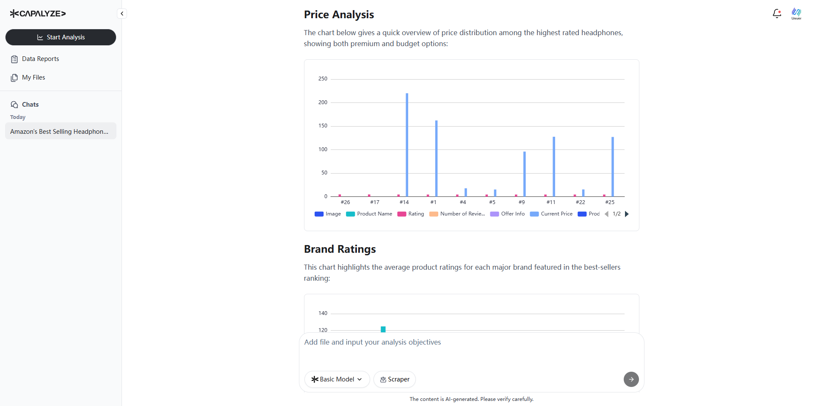

# How to Extract and Analyze Amazon Headphone Reviews with Capalyze: A Step-by-Step Tutorial

## Introduction

Capalyze is an AI-powered data analytics agent that transforms how individuals and businesses collect and analyze web and spreadsheet-style data. It uniquely combines natural language commands with automated web scraping and smart analysis features, enabling anyone—from e-commerce professionals to content creators—to extract valuable insights with minimal technical knowledge.

In this tutorial, we’ll walk you through how to use [Capalyze](https://capalyze.ai/) to extract and analyze Amazon product reviews. Specifically, you’ll learn how to capture customer reviews for Amazon’s best-selling headphones and generate intelligent insights in just a few minutes.

Whether you are in product research, market analysis, or simply exploring customer sentiment, Capalyze provides an end-to-end, no-code workflow that empowers data-driven decisions.

> The following video fully demonstrates the steps in the tutorial

### Step 1: Open Capalyze and Start a New Conversation

Go to [https://capalyze.ai](https://capalyze.ai) in your browser. Once you’re on the homepage, click to start a new conversation. In the chat box, type:

> **"Analysis of Amazon's best-selling headphones"**

Then hit send. Capalyze will begin processing your request and prepare to extract relevant data from the web.

### Step 2: Install the Chrome Extension

Capalyze uses a browser extension to enable intelligent data extraction. If this is your first time using it, you’ll be prompted to install the extension. Click **“Go Install”**, which will take you to the Chrome Web Store. Follow the standard installation steps.

This extension is essential for enabling Capalyze to automatically scan web pages and identify extractable data.

### Step 3: Automatic Pre-Extraction Process

After installation, the extension will automatically begin scanning the Amazon page related to best-selling headphones. Capalyze identifies key data points—such as product names, review counts, ratings, and product links—before you even hit the “Start Extraction” button.

This automated pre-extraction helps ensure data quality and relevance.

### Step 4: Start the Data Extraction

Switch back to the Capalyze tab. You’ll now see a preview of the data that’s ready to be collected. If everything looks good, click **“Start Extraction”**, then confirm to initiate the full extraction process.

Capalyze will now scrape the page, pulling in all the relevant review data in real time.

### Step 5: Live Extraction Monitoring

As the extraction runs, customer reviews are continuously being collected, with the total number steadily increasing.

This provides clear visibility into the process and helps ensure the results align with your expectations.

### Step 6: AI-Powered Data Analysis

Once extraction is complete, Capalyze immediately shifts into analysis mode. It will generate insights based on the collected data using AI-driven natural language processing.

You’ll see a “thinking” indicator on screen as it processes multiple layers of insight.

### Step 7: Explore Key Findings, Analysis, and Recommendations

Capalyze will output a detailed report, including:

* **Key Findings**: Highlights of the most important trends and sentiments
    
* **Detailed Analysis**: Breakdown of themes, customer preferences, and product comparisons
    
* **Conclusions and Recommendations**: Actionable suggestions based on the analysis
    
These insights can help you understand market sentiment, identify common product issues, or optimize your e-commerce strategy.

### Step 8: View and Download Structured Data

Capalyze presents all extracted data in clean, structured tables. These tables include product titles, star ratings, review texts, and more.

You can easily export this data in formats like Excel for further use in reporting, dashboards, or spreadsheets.

### Step 9: Customize and Download Charts

Capalyze also auto-generates data visualizations. These include pie charts, bar graphs, and trend lines that visualize customer sentiment, rating distributions, and recurring review themes.

All charts are editable and downloadable, making them presentation-ready and highly shareable.

## Conclusion

Capalyze is the only analytics tool that combines natural language commands, web scraping, and smart data analysis into a unified workflow. With just a few clicks, users can go from unstructured web data to actionable business insights—no coding required.

Try it yourself by visiting [https://capalyze.ai](https://capalyze.ai). Whether you're in e-commerce, real estate, content creation, or local business management, Capalyze empowers you to make smarter, faster, and more confident decisions with data.

## Additional Resources

* **Video Tutorial on YouTube**: [Watch now](https://www.youtube.com/watch?v=H43p352xT1M)
    
* **Capalyze on TikTok**: [Watch short demo](https://www.tiktok.com/@smartdatabrief/video/7512806334165683487)
    
* **Follow us on X (formerly Twitter)**: [@Capalyze](https://x.com/Capalyze/status/1930953659409735764)
    
Explore the power of automated data extraction and analysis with Capalyze — your AI agent for smarter decisions.

