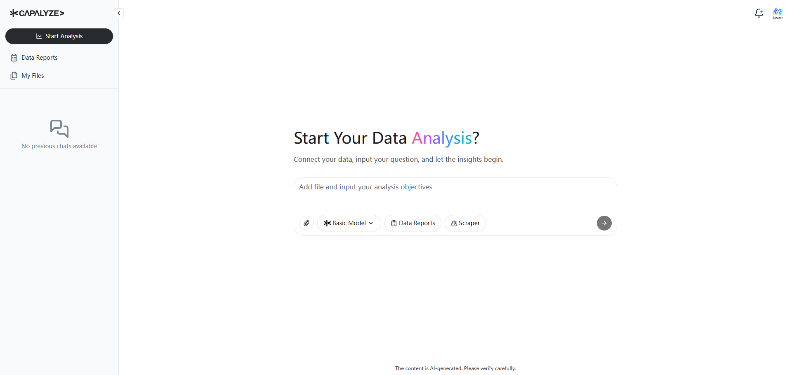
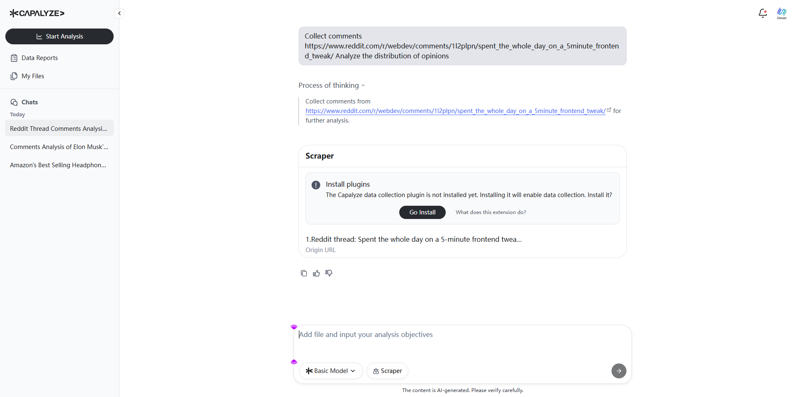
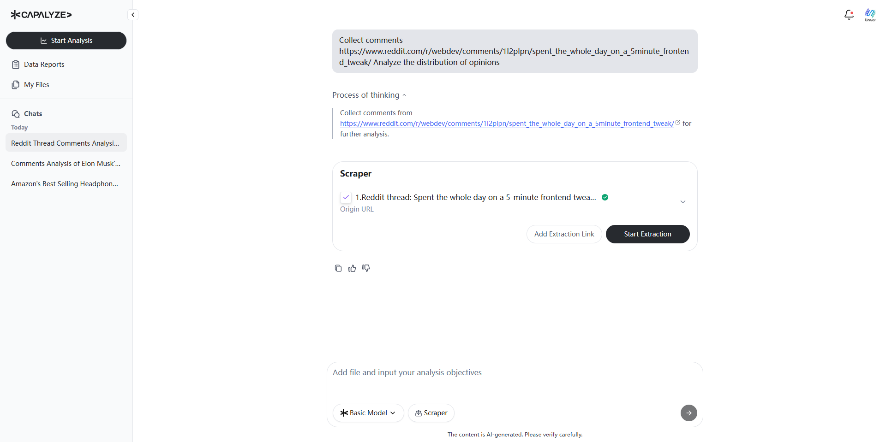
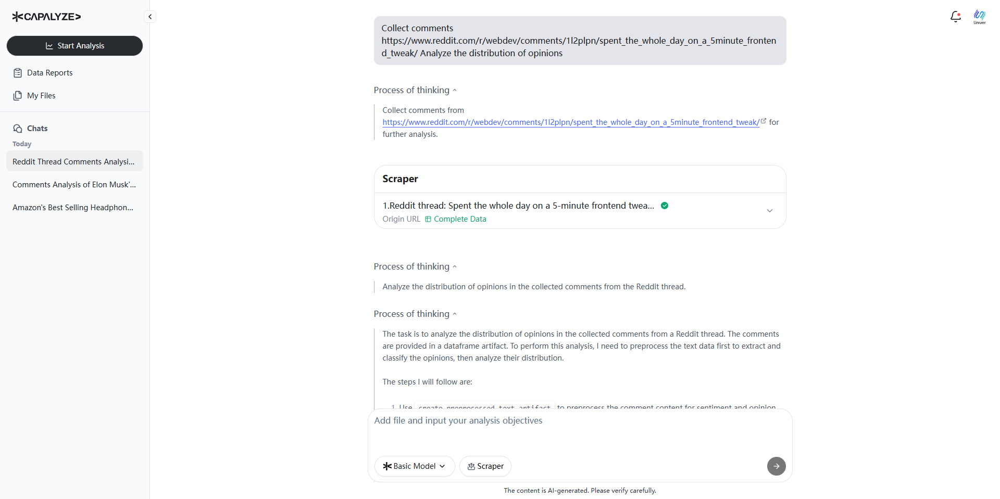
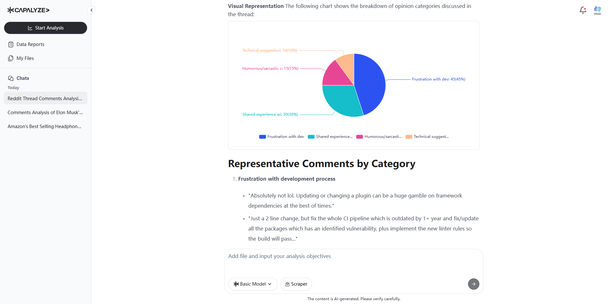
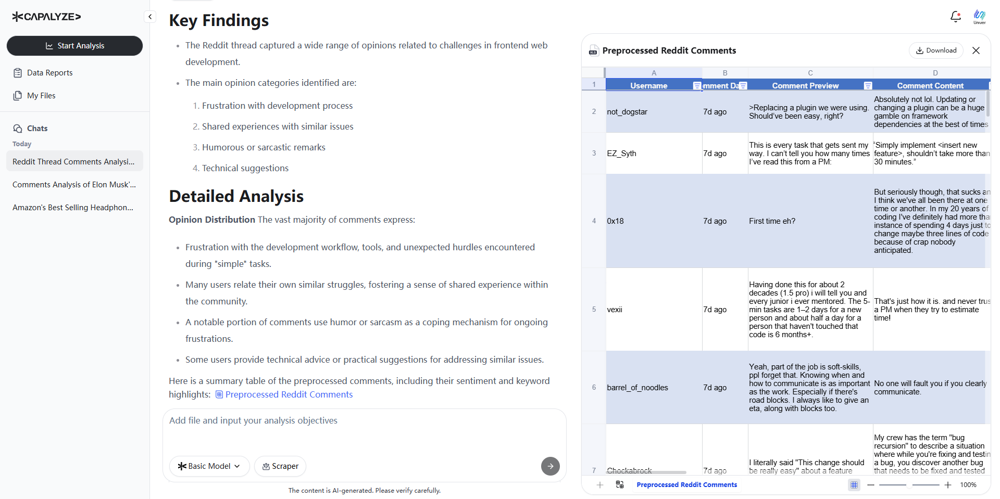

# How to Analyze Reddit Comments with Capalyze: A Step-by-Step Guide (WebDev Post Example)

## Introduction

Reddit is a goldmine for community-driven opinions, product feedback, and emerging trends. However, analyzing Reddit threads manually can be time-consuming and imprecise. That’s where [Capalyze](https://capalyze.ai/) comes in. Capalyze lets you extract and analyze Reddit comments using simple natural language commands—no coding or data science expertise required.

In this tutorial, we’ll walk through how to analyze a Reddit discussion from the r/webdev community. You'll see how Capalyze collects comments, categorizes sentiments, and delivers intelligent insights from an actual Reddit post—all in just a few clicks.

### Step 1: Visit Capalyze and Start a New Chat

Open your browser and navigate to [https://capalyze.ai](https://capalyze.ai). On the homepage, click to start a new conversation.

This will open a chat-based interface, where you can type your analysis request.

### Step 2: Enter the Reddit URL and Your Request

In the chat box, type the following:

> **“Collect comments [https://www.reddit.com/r/webdev/comments/1l2plpn/spent_the_whole_day_on_a_5minute_frontend_tweak/](https://www.reddit.com/r/webdev/comments/1l2plpn/spent_the_whole_day_on_a_5minute_frontend_tweak/) Analyze the distribution of opinions.”**

Then press Enter. Capalyze will recognize that this is a Reddit URL and prepare to launch its web extraction process.

### Step 3: Install the Capalyze Chrome Extension

To proceed with comment extraction, Capalyze will prompt you to install its Chrome extension. Click **“Go Install”**, and you’ll be redirected to the Chrome Web Store.

Install the extension in one click. It enables Capalyze to automatically collect comment data from Reddit and other supported platforms.

### Step 4: Pre-Scan of Reddit Comments

Once installed, Capalyze will automatically return to the page and initiate a **pre-scan** of the Reddit thread. It identifies the structure of the post and previews a few initial comments for your review.

This step ensures that the data source is valid and structured correctly before full extraction begins.

### Step 5: Launch the Full Extraction

In the chat, you’ll see a preview of sample comments. Click **“Start Extraction”** and confirm when prompted.

Capalyze now begins collecting the entire thread’s comments in real time.

### Step 6: Monitor Live Extraction

Capalyze automatically extracts both top-level comments and relevant replies. As the process runs, you'll see the number of collected comments steadily increasing.

This transparent approach gives you real-time insight into what's being gathered and how much data has been processed.

### Step 7: AI-Powered Comment Analysis

When extraction is complete, Capalyze immediately begins analyzing the data. Using advanced natural language understanding, it reviews each comment and classifies opinions, tones, and themes.

You'll see a message like “Analyze the distribution of opinions…” as Capalyze processes the dataset.

### Step 8: View Key Findings and Sentiment Distribution

Capalyze will generate a structured report that includes:

* **Key Findings**: Summarized insights about overall sentiment
    
* **Detailed Analysis**: Commentary breakdown by emotion, tone, or topic
    
* **Conclusions and Recommendations**: Actionable insights drawn from the discussion
    
In this example, the system identifies how many users agreed, disagreed, expressed frustration, or shared similar experiences related to a frontend dev task.

### Step 9: Visualize Opinion Distribution

You’ll also see a breakdown of how different viewpoints are represented across the comments. These categories reflect common themes or perspectives that emerge from the discussion.

For each category, representative comments are highlighted to give context and clarity to the opinions expressed.

### Step 10: Download Data and Export Charts

Need to use the raw data? Capalyze presents all extracted comments in a structured table, including usernames, timestamps, and sentiment labels. This dataset can be exported as Excel files.

Charts and visuals are also downloadable for use in slide decks, dashboards, or client reports.

## Conclusion

Capalyze makes it fast and easy to turn unstructured Reddit discussions into actionable intelligence. From product research to community sentiment analysis, you can now extract and interpret complex discussions with natural language prompts.

Start analyzing Reddit threads with [Capalyze](https://capalyze.ai) today. Whether you're in product development, content strategy, or social listening—Capalyze empowers you to work smarter with real-time web data.

## Additional Resources

* **YouTube**: [Watch now](https://www.youtube.com/watch?v=SnNjbmnW3c8)
    
* **TikTok**: [Capalyze in Action](https://www.tiktok.com/@capalyze/video/7514290134859353390)
    
* **Follow on X**: [@Capalyze](https://x.com/Capalyze/status/1932406438955196580)
    
Unlock insights from Reddit with just a link — Capalyze does the rest.