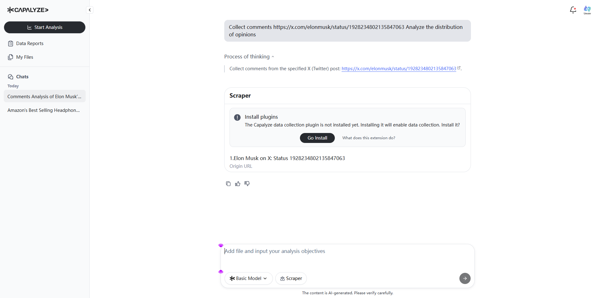
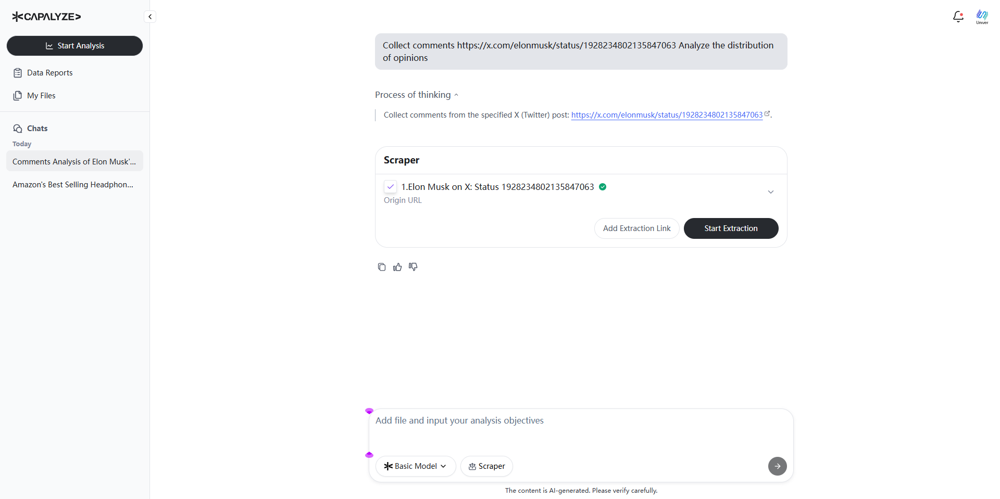
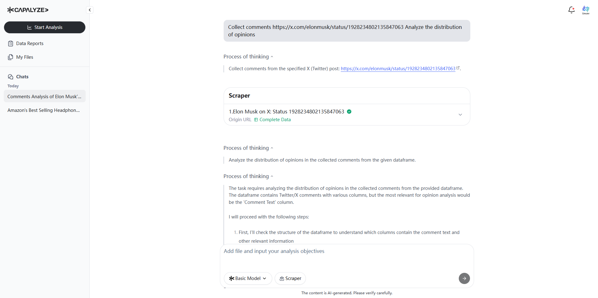
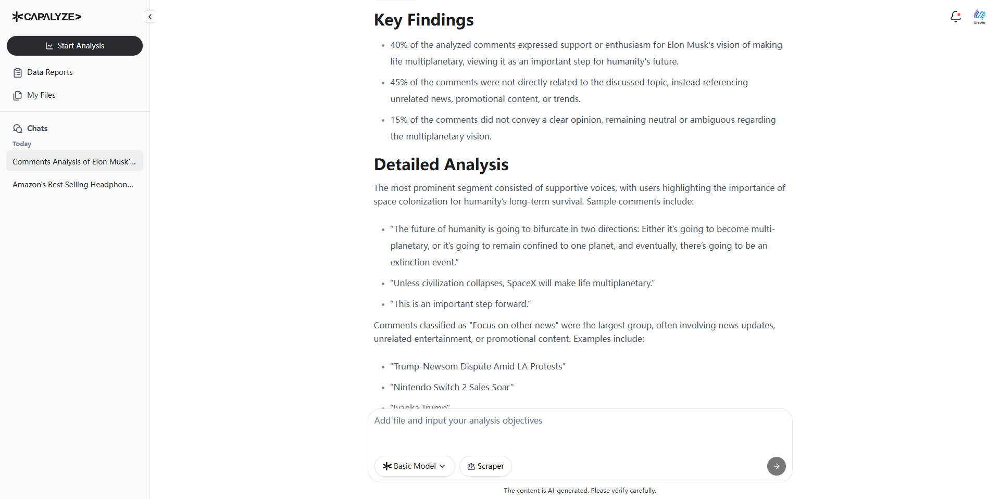

# How to Analyze X (Twitter) Comments with Capalyze: Elon Musk Tweet Case Study

## Introduction

Understanding public sentiment on social media can be crucial for marketers, analysts, researchers, and journalists. Whether you're tracking brand reputation, political reactions, or viral content, the key lies in analyzing conversations at scale—and that's where [Capalyze](https://capalyze.ai) comes in.

In this tutorial, we’ll show you how to use Capalyze to extract and analyze comments from a viral post on X (formerly Twitter), using a real example from Elon Musk. With its unique combination of natural language prompts, automated web scraping, and AI-driven insights, Capalyze makes social media sentiment analysis fast, accurate, and code-free.

### Step 1: Visit Capalyze and Start a New Conversation

Begin by navigating to [https://capalyze.ai](https://capalyze.ai). On the homepage, start a new conversation using the natural language interface.

In the chat box, enter:

> **“Collect comments [https://x.com/elonmusk/status/1928234802135847063](https://x.com/elonmusk/status/1928234802135847063) Analyze the distribution of opinions”**

Then press **Send**. Capalyze will interpret your request and begin the process of gathering relevant data.

### Step 2: Install the Capalyze Chrome Extension

To extract data from web pages—including social media posts—Capalyze requires its browser extension. You’ll be prompted to install it after submitting your request.

Click **“Go Install”** to open the Chrome Web Store, then follow the installation instructions. The extension is lightweight and installs in seconds.

### Step 3: Automatic Pre-Scan of Tweet Comments

Once the extension is installed, Capalyze automatically begins scanning the comment section of the target tweet. It identifies relevant replies and prepares for full-scale extraction.

This pre-scan ensures that only high-value, structured data is collected for analysis.

### Step 4: Review the Comment Preview and Start Extraction

Return to the Capalyze tab. You’ll see a preview of several user comments Capalyze is ready to extract.

Review the preview, then click **“Start Extraction”** to begin collecting the full dataset. Capalyze will now extract all available replies to the tweet in real time.

### Step 5: Monitor Real-Time Data Extraction

As the extraction progresses, Capalyze displays a real-time status button along with the number of comments being pulled in. This transparency lets you follow the process and confirm data relevance as it happens.

### Step 6: AI-Powered Sentiment Analysis Begins

Once data collection is complete, Capalyze immediately initiates analysis. Its AI engine reviews the content, interprets sentiment, and begins generating a structured summary of public opinion around the tweet.

This step requires no additional input—just let the AI process the data.

### Step 7: Review the Key Findings and Insights

Capalyze delivers a comprehensive set of insights, including:

* **Key Findings**: Top trends and themes identified in the conversation
    
* **Detailed Analysis**: Breakdowns of sentiments (positive, negative, neutral), keyword patterns, and recurring topics
    
* **Conclusions and Recommendations**: AI-generated summaries that help contextualize the response landscape
    
### Step 8: Analyze the Opinion Distribution

A core feature of Capalyze’s social media analysis is the opinion distribution breakdown—a clearly structured summary that helps you quickly gauge audience sentiment, from support to criticism.

You’ll also see representative comments listed under each sentiment category, giving clear context to every viewpoint.

## Conclusion

Capalyze makes social media intelligence accessible to everyone. By turning raw X (Twitter) comments into structured insights, you can better understand what people are saying—and why it matters.

Whether you're tracking a political post, analyzing customer feedback, or studying viral trends, Capalyze helps you move from noise to knowledge in minutes.

Start your own analysis today at [https://capalyze.ai](https://capalyze.ai).

## Additional Resources

* **Watch the Video Tutorial on YouTube**: [Click here](https://www.youtube.com/watch?v=4ovVyHv-4i8)
    
* **See the Demo on TikTok**: [Watch on TikTok](https://www.tiktok.com/@smartdatabrief/video/7513887969007111455)
    
* **Follow Capalyze on X**: [@Capalyze](https://x.com/Capalyze/status/1932010259138363690)
    
From tweets to trends, Capalyze helps you extract clarity from the conversation.